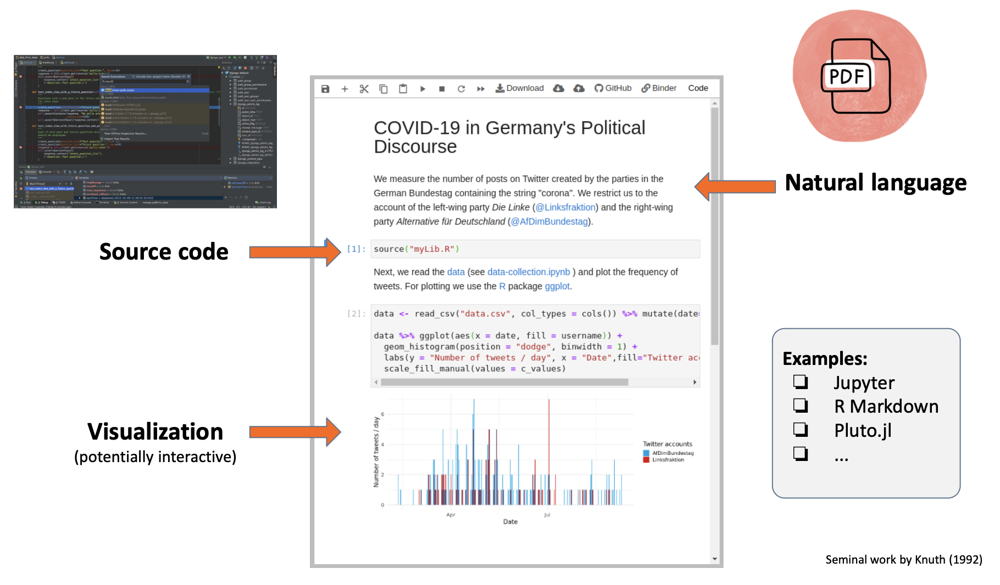
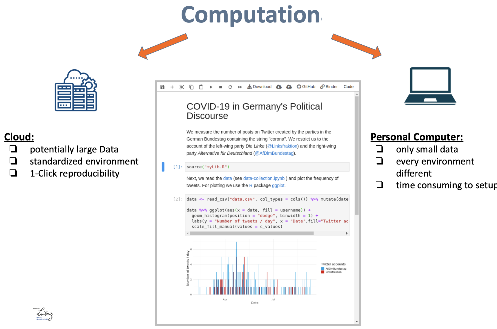

# Hallo [Jupyter](https://jupyter.org) *Notebooks* ;)
## Jour Fixe: [DSS](https://www.gesis.org/en/institute/departments/data-services-for-the-social-sciences)

**Datum:** 28.11.2022

**Referent:** [Arnim Bleier](https://www.gesis.org/en/institute/staff/person/arnim.bleier)

### [Literate programming](https://de.wikipedia.org/wiki/Literate_programming)

> Mit literate programming (engl., näherungsweise mit literarisches Programmieren übersetzbar) bezeichnet man das Schreiben von Computerprogrammen in einer Form, so dass sie vor allem für Menschen lesbar sind. (Wikipedia)

---

<= Hier geht es los!
--- 

### Jupyter Notebooks & MyBinder

- Vorlesung: [Folien](https://raw.githubusercontent.com/jobreu/reproducible-research-gesis-2022/main/slides/Binder.pdf), [Beispiel](https://github.com/arnim/ggplot2Demo)

- Übung: [Folien](https://raw.githubusercontent.com/jobreu/reproducible-research-gesis-2022/main/exercises/Binder_exercise.pdf), [Beispiel](https://github.com/arnim/COVID-19_Binder)

Materialien aus dem Workshop aus dem [Workshop](https://github.com/jobreu/reproducible-research-gesis-2022) *Tools and Workflows for Reproducible Research in the Quantitative Social Sciences*.

---
### Die Grenzen von Notebooks verstehen

> Understand why some people don't like notebooks, including how working in notebooks ties your hands in a lot of ways, the Python that you miss when you work in notebooks, why a nontrivial number of Python users find notebooks difficult, and more

=> Joel Grus JupyterCon 2018 Vortrag [I don't like notebooks](https://conferences.oreilly.com/jupyter/jup-ny/public/schedule/detail/68282.html)

--- 
## Terms of Use

Materials are licensed under [CC BY-SA 4.0](http://creativecommons.org/licenses/by-sa/4.0/).

